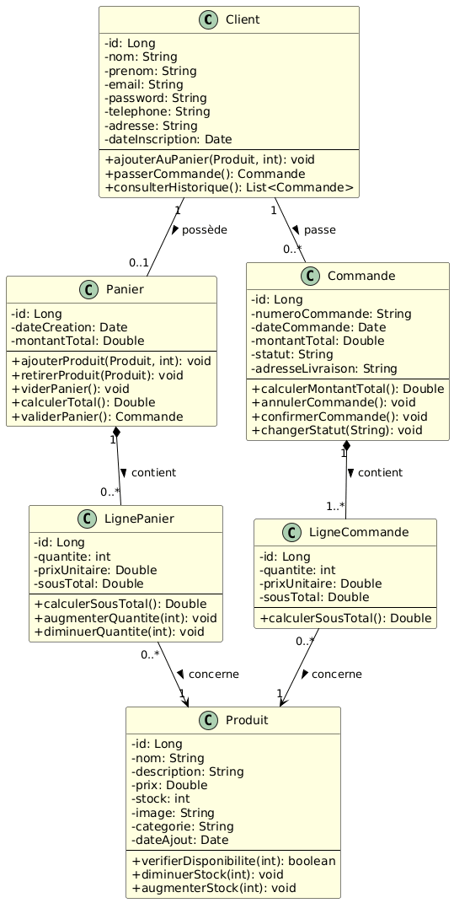
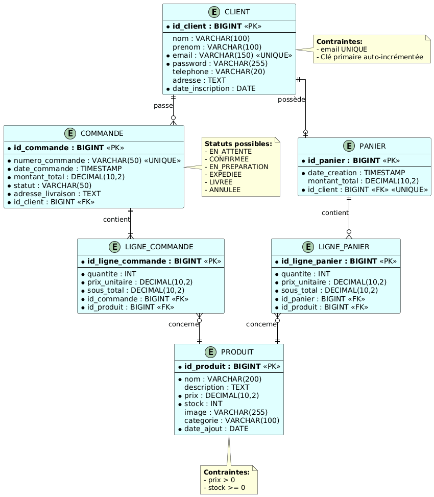

# Application Web e-Commerce basée sur MVC2 et JPA

## Mini Rapport - Atelier Applications Distribuées

**Université Abdelmalek Essaâdi**  
**Faculté des Sciences et Techniques de Tanger**  
**Département Génie Informatique - Cycle Master MSI**  
**Module :** Applications Distribuées  
**Encadré par :** Pr. ELAACHAK Lotfi

---

## Objectifs

L'objectif principal de cet atelier est de maîtriser l'API JPA (Java Persistence API) par la mise en place d'une application web qui simule le comportement d'un site web e-Commerce. 

Les objectifs spécifiques sont :

- Concevoir et implémenter un modèle de données pour une application e-commerce
- Maîtriser l'utilisation de JPA pour la persistance des données
- Appliquer le patron de conception MVC2 avec une architecture basée sur des Servlets
- Utiliser l'injection de dépendances via CDI pour la communication entre les couches
- Gérer les entités principales : Panier, Vitrine et Internaute
- Développer une interface utilisateur dynamique avec JSP et JSTL

---

## Outils et Technologies

Le développement de cette application nécessite les outils et technologies suivants :

| Outil/Technologie | Rôle |
|-------------------|------|
| **IntelliJ IDEA** | Environnement de développement intégré |
| **Maven** | Gestionnaire de dépendances et build |
| **WildFly** | Serveur d'application Java EE |
| **MySQL** | Système de gestion de base de données |
| **JPA** | API de persistance Java |
| **CDI** | Contexts and Dependency Injection |
| **JSP/JSTL** | Technologies de présentation |

---

## Architecture et Conception

### Diagramme de Classes

Le diagramme de classes UML représente la structure du système e-commerce avec les entités principales et leurs relations.



*Note : Le diagramme illustre les classes Panier, Produit, Internaute, LignePanier et leurs associations.*

---

### Modèle Logique de Données (MLD)

Le modèle logique de données représente la structure de la base de données MySQL générée par JPA.



*Note : Le MLD montre les tables, les clés primaires, les clés étrangères et les relations entre les entités.*

---

## Étapes de Réalisation

### Étape 1 : Conception UML

Création du diagramme de classes représentant la gestion d'un site e-commerce. Le diagramme se concentre sur :

- **Gestion du panier** : ajout, suppression, modification des produits
- **Gestion de la vitrine** : affichage et recherche des produits
- **Gestion des internautes** : authentification et profil utilisateur

Les relations entre les entités (association, composition, agrégation) sont clairement définies.

---

### Étape 2 : Configuration du Projet Maven

#### 2.1 Création du projet

1. Créer un projet Web dynamique avec un web module version supérieure à 3.0
2. Convertir le projet vers un projet Maven
3. Configurer la structure du projet

#### 2.2 Configuration du fichier pom.xml

Ajouter les dépendances nécessaires :

```xml
<dependencies>
    <!-- MySQL Connector -->
    <dependency>
        <groupId>mysql</groupId>
        <artifactId>mysql-connector-java</artifactId>
        <version>8.0.12</version>
    </dependency>
    
    <!-- JPA API -->
    <dependency>
        <groupId>javax.persistence</groupId>
        <artifactId>javax.persistence-api</artifactId>
        <version>2.2</version>
        <scope>provided</scope>
    </dependency>
</dependencies>
```

---

### Étape 3 : Couche Persistance (Modèle)

#### 3.1 Configuration JPA

Créer le fichier de configuration `persistence.xml` dans le répertoire `src/main/resources/META-INF/` :

```xml
<?xml version="1.0" encoding="UTF-8"?>
<persistence xmlns="http://xmlns.jcp.org/xml/ns/persistence" version="2.2">
    <persistence-unit name="ecommerce-unit" transaction-type="JTA">
        <jta-data-source>java:jboss/datasources/MySqlDS</jta-data-source>
        <properties>
            <property name="hibernate.dialect" value="org.hibernate.dialect.MySQL8Dialect"/>
            <property name="hibernate.hbm2ddl.auto" value="update"/>
            <property name="hibernate.show_sql" value="true"/>
        </properties>
    </persistence-unit>
</persistence>
```

#### 3.2 Création des Entités JPA

Développer les entités correspondant au diagramme de classes :

- `Panier.java` : représente le panier d'achat
- `Produit.java` : représente les articles disponibles
- `Cient.java` : représente les utilisateurs
- `LignePanier.java` : représente les produits dans le panier
- `Commande.java` : représente les Commandes
- `LigneCommande.java` : représente les lignes des Commandes
- Relations entre entités avec les annotations JPA appropriées

#### 3.3 Génération de la Base de Données

La base de données MySQL est générée automatiquement par JPA lors du premier déploiement grâce à la propriété `hibernate.hbm2ddl.auto=update`.

---

### Étape 4 : Couche Contrôleur (Servlets MVC2)

#### 4.1 Architecture MVC2

L'application suit le patron de conception MVC2 où :

- **Modèle** : Entités JPA + Services métier
- **Vue** : Pages JSP avec expressions JSTL
- **Contrôleur** : Servlets contenant plusieurs actions

#### 4.2 Implémentation des Servlets

Créer une Servlet par gestion avec plusieurs actions :

**Exemple : PanierServlet**
voir le fichier (PanierServlet)
#### 4.3 Injection de Dépendances (CDI)

voir le fichier PnierService

Configuration CDI dans `beans.xml` :

```xml
<?xml version="1.0" encoding="UTF-8"?>
<beans xmlns="http://xmlns.jcp.org/xml/ns/javaee"
       version="1.1" bean-discovery-mode="all">
</beans>
```

---

### Étape 5 : Couche Vue (JSP + JSTL)

#### 5.1 Utilisation de JSTL

Les pages JSP utilisent les expressions JSTL au lieu de scriptlets Java :

```jsp
<%@ taglib prefix="c" uri="http://java.sun.com/jsp/jstl/core" %>

<c:forEach items="${produits}" var="produit">
    <div class="produit">
        <h3>${produit.nom}</h3>
        <p>Prix : ${produit.prix} DH</p>
        <a href="panier?action=ajouter&id=${produit.id}">Ajouter au panier</a>
    </div>
</c:forEach>
```

## Structure du Projet

```
ecommerce-jpa/
│
├── docs/
│   └── images/                        # Images pour la documentation
│       ├── class-diagram.png
│       └── mld.png
│
├── src/
│   ├── main/
│   │   ├── java/
│   │   │   └── org/example/
│   │   │       ├── entities/          # Entités JPA
│   │   │       │   ├── Panier.java
│   │   │       │   ├── Produit.java
│   │   │       │   ├── Internaute.java
│   │   │       │   └── LignePanier.java
                        ........
│   │   │       │
│   │   │       ├── services/          # Services métier
│   │   │       │   ├── PanierService.java
│   │   │       │   ├── ProduitService.java
│   │   │       │   └── InternauteService.java
                      ...............
│   │   │       │
│   │   │       └── servlets/          # Contrôleurs MVC2
│   │   │           ├── PanierServlet.java
│   │   │           └── InternauteServlet.java
                        ...............
│   │   │
│   │   ├── resources/
│   │   │   └── META-INF/
│   │   │       └── persistence.xml    # Configuration JPA
│   │   │
│   │   └── webapp/
│   │       ├── WEB-INF/
│   │       │   ├── web.xml           # Configuration web
│   │       │   └── beans.xml         # Configuration CDI
│   │       │
│   │       ├── pages/                # Pages JSP
│   │       │   ├── panier.jsp
│   │       │   └── profil.jsp
                        ...............
│   │       │
│   │       ├── css/                  # Feuilles de style
│   │       ├── js/                   # Scripts JavaScript
│   │       └── index.jsp             # Page d'accueil
│   │
│   └── test/
│       └── java/                     # Tests unitaires
│
├── pom.xml                           # Configuration Maven
└── README.md                         # Ce fichier
```

---

## Instructions de Build et Déploiement

### Prérequis

- JDK 8 ou supérieur installé
- Maven 3.x installé
- MySQL Server 8.x installé et démarré
- WildFly Server configuré

### Configuration de la Base de Données

1. Créer la base de données MySQL :

```sql
CREATE DATABASE ecommerce_db CHARACTER SET utf8mb4 COLLATE utf8mb4_unicode_ci;
CREATE USER 'ecommerce_user'@'localhost' IDENTIFIED BY 'password';
GRANT ALL PRIVILEGES ON ecommerce_db.* TO 'ecommerce_user'@'localhost';
FLUSH PRIVILEGES;
```

2. Configurer la DataSource dans WildFly (fichier `standalone.xml`) :

```xml
<datasource jndi-name="java:jboss/datasources/MySqlDS" pool-name="MySqlDS">
    <connection-url>jdbc:mysql://localhost:3306/ecommerce_db</connection-url>
    <driver>mysql</driver>
    <security>
        <user-name>ecommerce_user</user-name>
        <password>password</password>
    </security>
</datasource>
```

### Build du Projet

```bash
# Nettoyer et compiler le projet
mvn clean compile

# Créer le package WAR
mvn package

# Le fichier ecommerce.war sera généré dans le répertoire target/
```

### Déploiement sur WildFly

#### Option 1 : Déploiement manuel

```bash
# Copier le fichier WAR dans le répertoire de déploiement
cp target/ecommerce.war $WILDFLY_HOME/standalone/deployments/
```

#### Option 2 : Déploiement via Maven

Configurer le plugin WildFly dans `pom.xml` :

```xml
<plugin>
    <groupId>org.wildfly.plugins</groupId>
    <artifactId>wildfly-maven-plugin</artifactId>
    <version>2.0.2.Final</version>
</plugin>
```

Déployer avec :

```bash
mvn wildfly:deploy
```

## Résultats et Observations

### Points Clés de l'Implémentation

1. **Persistance JPA** : Les entités JPA sont correctement mappées et la base de données est générée automatiquement
2. **Architecture MVC2** : Séparation claire entre le modèle, la vue et le contrôleur
3. **Injection CDI** : Communication fluide entre les couches via l'injection de dépendances
4. **Interface utilisateur** : Pages JSP dynamiques utilisant JSTL pour l'affichage des données

### Difficultés Rencontrées et Solutions

Les principales difficultés peuvent inclure :

- Configuration de la DataSource dans WildFly
- Gestion des transactions JPA
- Relations bidirectionnelles entre entités
- Synchronisation du contexte de persistance

---

## Code Source

Le code complet de l'application est disponible dans ce repository GitHub. La structure suit les bonnes pratiques Java EE et le code est organisé en packages logiques pour faciliter la maintenance et l'évolution du projet.
